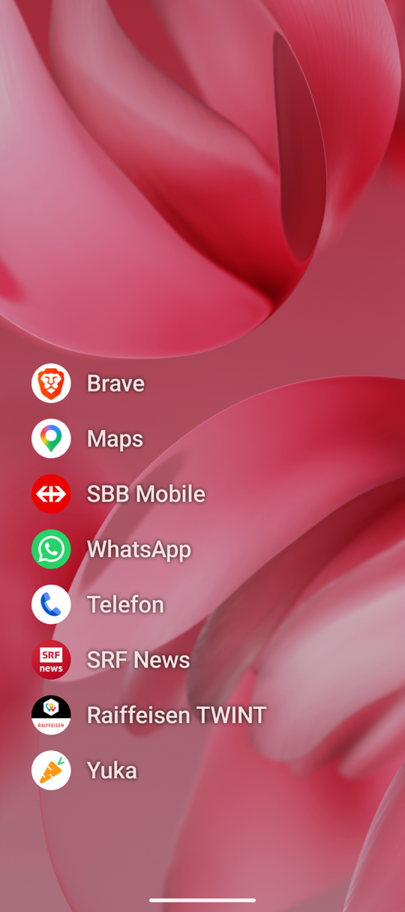
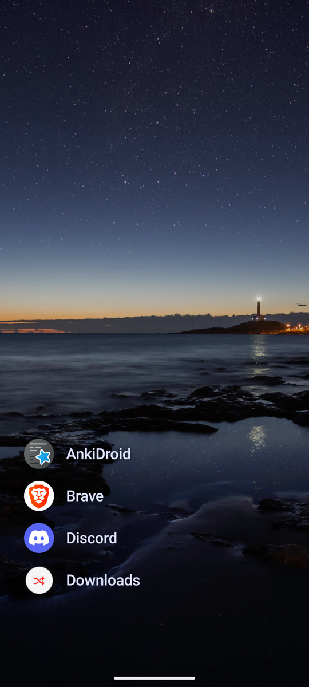
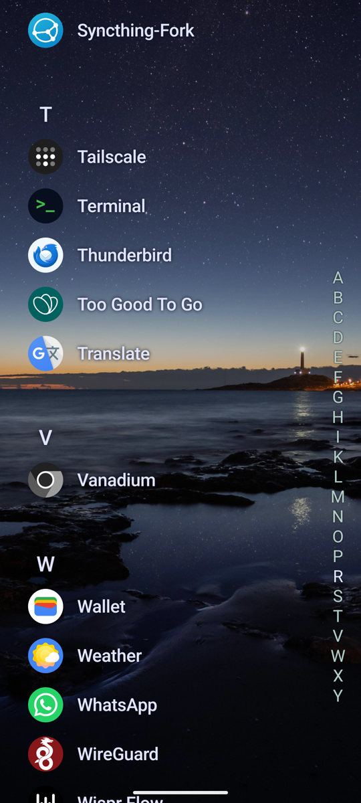

# Ni-Launcher

Ni-Launcher is a fast, minimal Android launcher focused on reducing distractions. It avoids layout shift and keeps navigation quick and predictable.

**Values**
- No layout shift
- Fast navigation
- reduce distractions

**Highlights**
- Nested tags instead of folders
- Quick app access with tag-driven organization
- Minimal UI with gesture-first flows

## Installation

### APK
1. Navigate to the [Releases](https://github.com/Dovonun/android-launcher/releases) page.
2. Download the latest `ni-launcher-release.apk`.
3. Open the file on your device to install.

### Beta APK
Beta builds are published from merges to `main` as GitHub prereleases.

### Local Development
Local side-by-side development builds use the `com.ni.launcher.dev` application id and install as `Ni-Launcher Dev`, so you can keep the public app installed from Obtainium while testing local changes.

### Obtainium
For automated updates via [Obtainium](https://github.com/ImranR98/Obtainium), add this repository URL:
`https://github.com/Dovonun/android-launcher`

<a href="https://apps.obtainium.imranr.dev/redirect?r=obtainium%3A%2F%2Fapp%2F%7B%22id%22%3A%22com.ni.launcher%22%2C%22url%22%3A%22https%3A%2F%2Fgithub.com%2FDovonun%2Fandroid-launcher%22%2C%22author%22%3A%22Dovonun%22%2C%22name%22%3A%22Ni-Launcher%22%2C%22preferredApkIndex%22%3A0%2C%22additionalSettings%22%3A%22%7B%5C%22verifyLatestTag%5C%22%3Atrue%2C%5C%22apkFilterRegEx%5C%22%3A%5C%22ni-launcher-release.apk%5C%22%7D%22%2C%22overrideSource%22%3Anull%7D"></a>

The badge URL can be regenerated with:

```sh
python3 -c 'import json, urllib.parse; payload={"id":"com.ni.launcher","url":"https://github.com/Dovonun/android-launcher","author":"Dovonun","name":"Ni-Launcher","preferredApkIndex":0,"additionalSettings":json.dumps({"verifyLatestTag":True,"apkFilterRegEx":"ni-launcher-release.apk"},separators=(",",":")),"overrideSource":None}; uri="obtainium://app/"+json.dumps(payload,separators=(",",":")); print("https://apps.obtainium.imranr.dev/redirect?r="+urllib.parse.quote(uri,safe=""))'
```

## Security & Verification

### Optional: AppVerifier
You can verify the authenticity of APK releases using [AppVerifier](https://github.com/stefan-niedermann/AppVerifier).

- **Application ID:** `com.ni.launcher`
- **Certificate SHA-256 Fingerprint:** 6B:B3:73:F1:26:D5:C0:FF:A8:FF:FD:31:2C:7E:D9:B4:90:91:8E:73:38:27:44:BB:76:8D:74:9B:1E:64:E2:57
## Screenshots

<p>
  
  
  
</p>

Wallpaper in screenshots: [Lighthouse, Tower, Ocean by Leolo212](https://pixabay.com/photos/lighthouse-tower-ocean-sea-beach-5622924/)
